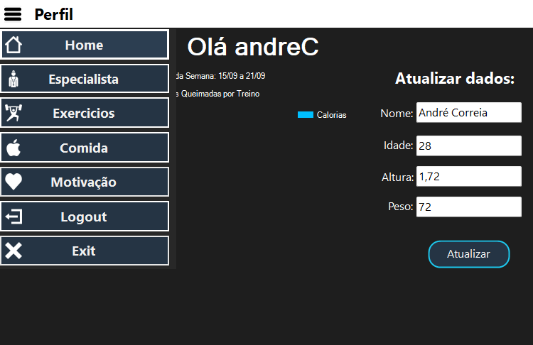
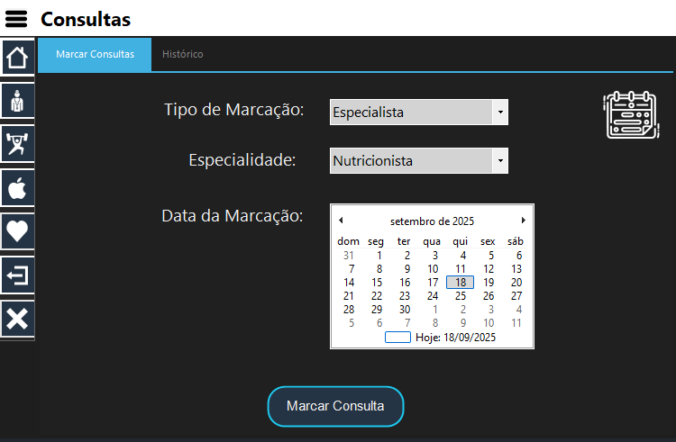

# 🌸 UC-620 — APP Fitness

> Educational project developed for the UC-620 module.  
> Focused on practicing programming, teamwork, and software design.


---

## 📖 About

APP Fitness is a project created within the scope of **UC-620**.  
It aims to demonstrate concepts of software development while solving real or simulated problems through code.

The project includes:

- Clean and organized structure  
- Practical application of course concepts  
- Expandable and modular code  

---

## 🚀 Features

- ✅ Core functionality of the assignment  
- ✅ User-friendly interaction (console / GUI)  
- ✅ Well-documented code  
- ✅ Organized folder structure  

---

## 📂 Project Structure
```
UC-620---FILOMENA/
├─ src/ ← main source code
├─ assets/ ← images, data files, or other resources
├─ docs/ ← documentation
├─ .gitignore
└─ README.md
```

---

## 🛠️ Tech Stack

- **Language:** C# / Java / Python *(adjust to your project)*  
- **Frameworks:** .NET / JavaFX / Tkinter *(if used)*  
- **Tools:** Git, Visual Studio / IntelliJ / VS Code  

---

## 📸 Screenshots






---

## 🏁 Getting Started

### 1️⃣ Clone the repo
```bash
git clone https://github.com/leonormcjoaquim/UC-620---FILOMENA.git
```
### 2️⃣ Open the project
```bash
Open in your preferred IDE.
```
### 3️⃣ Run
```bash
Follow the instructions for your environment.
```

---

# 👤 Authors
- Leonor M. C. Joaquim – GitHub: [@leonormcjoaquim](https://github.com/leonormcjoaquim)  
- André Correia – GitHub: [@Brekey53](https://github.com/Brekey53)